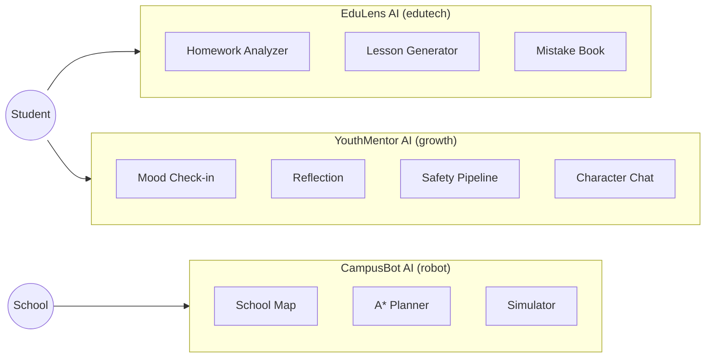
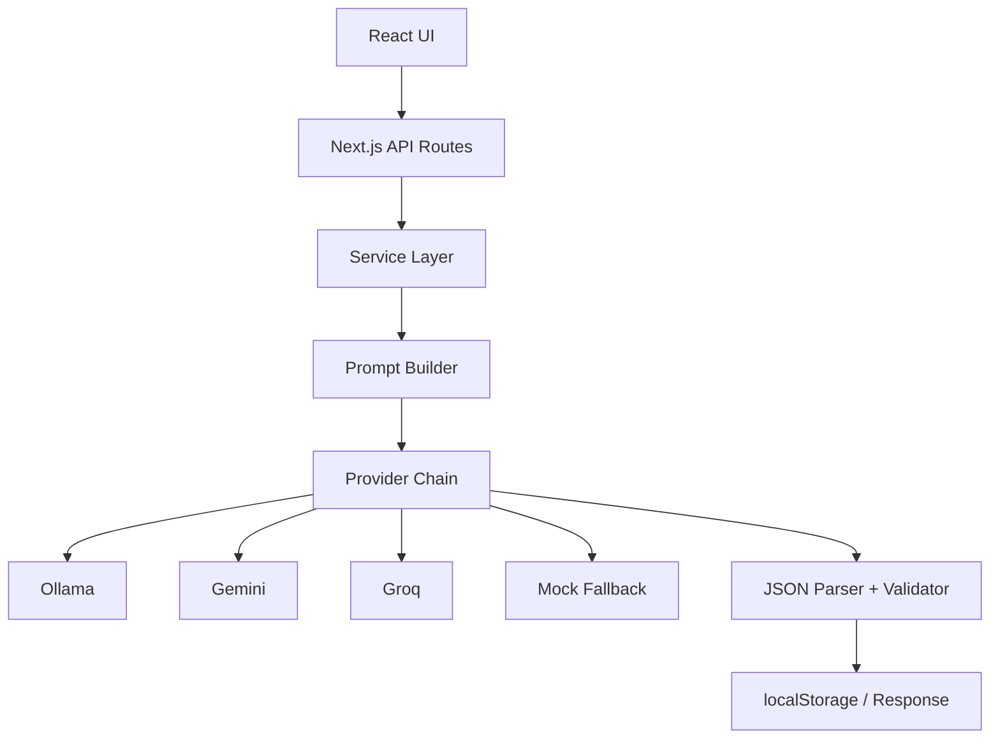
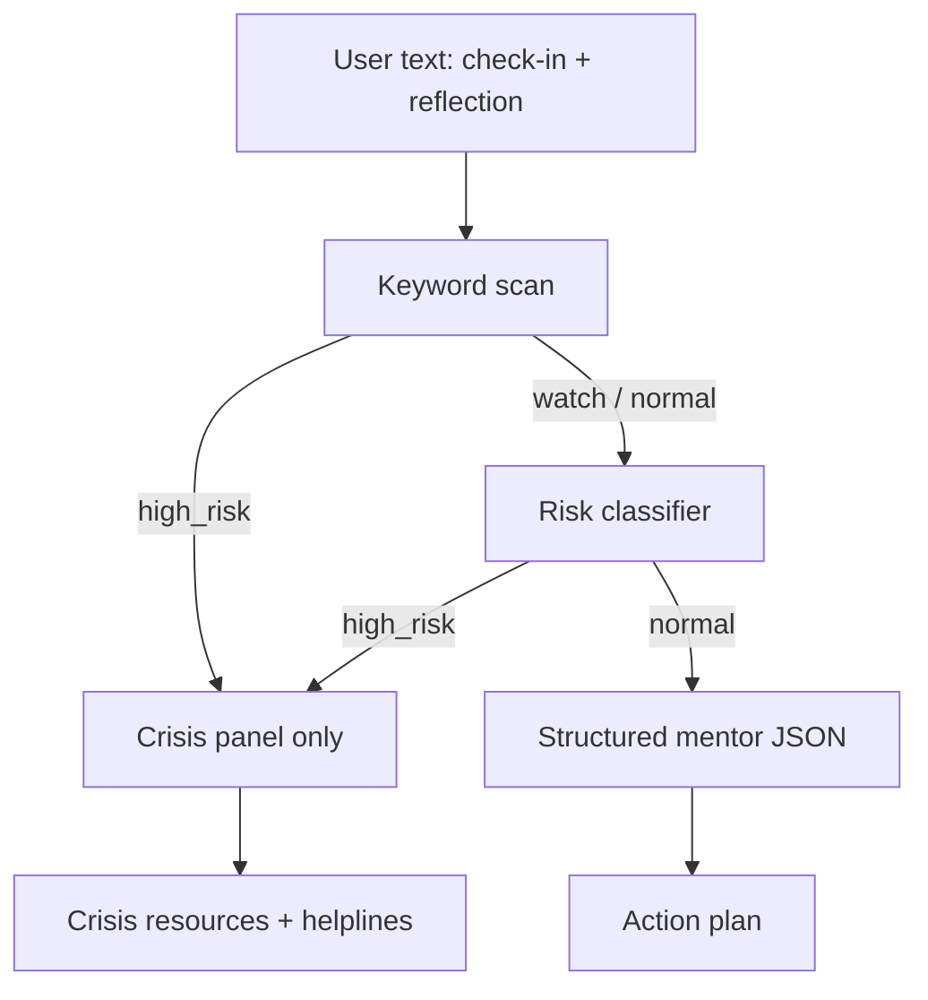
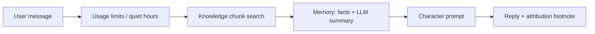
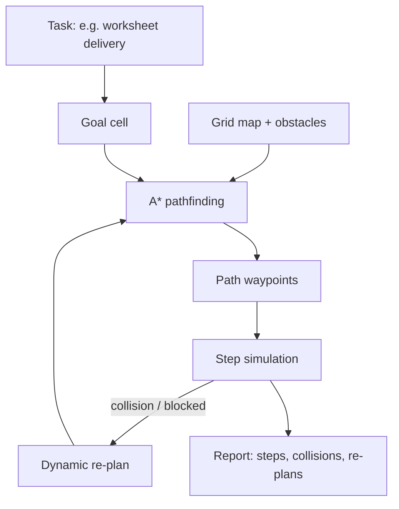

# NeuroSpark Suite — Architecture

## Suite overview



## Shared AI layer (EduLens + YouthMentor)



**Provider chain:** `OLLAMA → GEMINI → GROQ → … → MOCK`  
Configured via `EDULENS_PROVIDER_CHAIN` and `EDULENS_AI_MODE`.

## YouthMentor safety pipeline



**Design decisions:**

1. **Never rely on LLM alone for safety** — keyword layer runs first; high-risk blocks before any coaching prompt.
2. **localStorage** — no server database for reflections; fits PDPA-minded youth products and works offline for history.
3. **RAG-lite** — persona knowledge chunks retrieved by intimacy level; deeper chunks unlock with engagement, not payment alone.

## YouthMentor character chat



## CampusBot navigation



## Deployment topology (Vercel)

```mermaid
flowchart TB
  subgraph Vercel["Vercel (3 projects)"]
    VE[EduLens app]
    VG[YouthMentor app]
    VR[CampusBot app]
  end
  CDN[Edge CDN — SG region] --> Vercel
  VE --> API1[/api/* serverless]
  VG --> API2[/api/* serverless]
  API1 --> LLM[External LLM APIs]
  API2 --> LLM
  VR --> STATIC[Static + client simulation]
```

Each app is a **separate Vercel project** (different roots: `edutech/`, `growth/`, `robot/`).  
Set `EDULENS_AI_MODE=mock` on Vercel for reliable demo without API keys.

## Data flow & privacy

| Data | Where stored | Shared? |
|------|--------------|---------|
| Reflections, mood history | Browser `localStorage` | No — device only |
| Character chat memory | Browser `localStorage` | No |
| Insights dashboard aggregates | Browser `localStorage` | Anonymous local only |
| LLM requests | Server API route → provider | Prompt text only; no persistent server DB |

## Future extensions (not implemented)

- Supabase cloud sync stub in YouthMentor Settings  
- Real robot hardware (Arduino / ROS2) for CampusBot  
- School admin SSO for EduLens class dashboards
